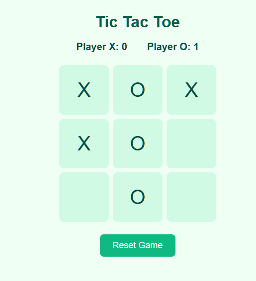

# Tic-Tac-Toe Game 🟢❌

A simple, interactive **Tic-Tac-Toe** game built with HTML, CSS, and JavaScript. Keep track of player scores and reset the board to play multiple rounds. 🎮

---

## Features ✨

- 2-player game (X and O) ❌🟢  
- Real-time score tracking 📊  
- Detects wins, draws, and game over 🏆  
- Reset button to start a new game 🔄  
- Responsive and simple design 📱💻  

---

## How to Play 🕹️

1. Click on any empty cell to place your symbol (X or O).  
2. Players alternate turns automatically 🔁  
3. The game checks for a winning pattern after each move ✅  
4. The score is updated automatically when a player wins 🏅  
5. Click **Reset** to clear the board and start a new round 🔄  

**Gameplay Demo:**  
  

---

## Win Patterns 🏆

The game checks the following patterns to determine a winner:

- **Horizontal:** `[0,1,2]`, `[3,4,5]`, `[6,7,8]`  
- **Vertical:** `[0,3,6]`, `[1,4,7]`, `[2,5,8]`  
- **Diagonal:** `[0,4,8]`, `[2,4,6]`  

---

## Installation 💻

Clone the repository:

```bash
git clone <your-repo-url>
